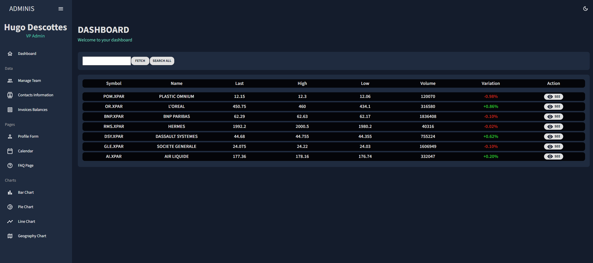
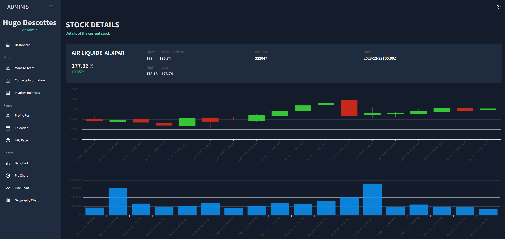

# Stock market Dashboard


## Description
<p>This project is a stock market dashboard for my personal need.<br>
It uses the https://marketstack.com api to retrieve the stock information.<br>
You can fetch new stocks with the corresponding symbol (https://marketstack.com/search) and check its details up to 1 month (for now).
</p>

#### App-api
SpringBoot server with hibernate as ORM and Postgresql as database (with docker)

#### App-ui
React application<br>
Cypress end-to-end tests

## Configuration

#### Docker
Command line to generate images and start containers :
```
docker-compose -f docker/docker-compose.yml up
```

#### Kubernetes
To deploy the application on a kubernetes cluster, use the following command :
```
kubectl apply -k k8s/
```

-------
## Demo
<p style="text-align:center">
  
  
</p>