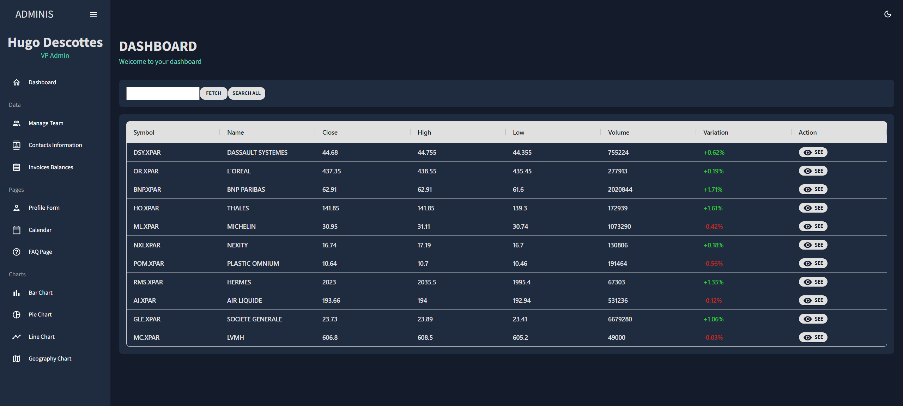

# Stock market Dashboard

## Description

This project is a stock market dashboard for my personal need. 
It uses the https://marketstack.com api to retrieve the stock information. 
You can fetch new stocks with the corresponding symbol (https://marketstack.com/search) and check its details up to 1 month (for now).

#### App-api
SpringBoot server with hibernate as ORM and Postgresql as database (with docker)

#### App-ui
React application
Cypress end-to-end tests

-------
## Demo

  
  

demo with the new DA (can't show it on a public repo)

